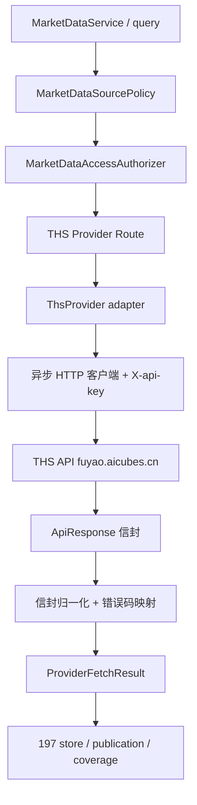

# 迭代 198：同花顺数据源接入设计

> 本文所有新增组件、契约、配置均为拟设计合同，不表示已实现。
> 需求编号见 REQUIREMENTS；逐项数据域映射见 DATA_SCOPE。
> 复用迭代 197 已落地的 provider 抽象：`MarketDataProvider` Protocol、`MarketDataProviderRequest`、`ProviderFetchResult`、`ProviderContract`、`MarketDataProviderRoute`、`MarketDataSourcePolicy`、`DatasetContract`。

## D1. 架构与职责

THS 是纯 HTTP REST 源，无需像 OpenBB 那样做隔离 SDK 子进程。作为**进程内异步 HTTP adapter**实现，复用 197 的授权（`access.py`）、store、publication、coverage 全链路；仅在 provider 层新增 THS 专属组件。



### D1.1 组件表

| 组件 | 职责 | 不应拥有的职责 |
| --- | --- | --- |
| `ThsProvider` | 实现 `MarketDataProvider.fetch`，调 THS REST，归一化结果 | 写存储、做 source policy 决策 |
| `ThsHttpClient` | 有界异步 HTTP、超时、取消、响应体上限 | 解析业务语义 |
| `ThsEnvelopeCodec` | 解析 `ApiResponse`，映射错误码 | 决定路由/权限 |
| `ThsProviderContract` | 静态 THS 路由契约（复用 `ProviderContract`） | 动态网络探测 |
| `ThsCredentials` | 从 credential ref 解析 `X-api-key` | 明文落库/日志 |
| `ThsRateLimiter` | 429/4001 退避、熔断 | 合并其他来源额度 |

复用：`provider_models.MarketDataProviderRequest` / `ProviderFetchResult` / `ProviderMarketObservation`；`provider_contracts.ProviderContract`；`source_policy.MarketDataProviderRoute` / `MarketDataSourcePolicy`；`dataset_contracts`；`access.MarketDataAccessAuthorizer`；`store` / `publication` / `coverage`。

## D2. Provider 契约接入

### D2.1 THS 作为第三个 provider

- `provider="ths"`，`request_provider="ths"`，`expected_result_provider_ids=frozenset({"ths"})`
- 复用 `ProviderContract` 的字段轮廓（field profile、timestamp columns、symbol columns、identity proof、endpoint resolver 等）
- 与 AkShare 的 `AKSHARE_PROVIDER_CONTRACTS` 并列，新增 `THS_PROVIDER_CONTRACTS` + `THS_PROVIDER_CONTRACT_REGISTRY`

### D2.2 THS 路由契约要点

THS 与 AkShare 的关键差异需在 `ProviderContract` 层显式表达：

| 维度 | AkShare | THS |
| --- | --- | --- |
| 请求变换 | 日期转 `YYYYMMDD`、period 映射 | 毫秒戳、`thscode`、`interval`、`adjust` 映射 |
| 时间戳列 | `日期`/`date` 字符串 | `date_ms`/`period_end_ms` 毫秒戳 |
| 身份证明 | `response_symbol`（含代码列） | `source_request_bound`（thscode 入参）+ 响应 `thscode` |
| 复权 | `adjust=""`/qfq/hfq | `adjust=none`/forward/backward |
| 信封 | DataFrame | `ApiResponse` |

因此需要：
- 新增 `request_transform_id`（如 `ths.historical-kline-request-v1`、`ths.financials-request-v1`、`ths.symbol-only-request-v1`）
- 新增 `timestamp_normalizer_id`（如 `ths.millis-timestamp-normalizer-v1`）
- 新增 `window_semantics`（THS 为**闭区间** `[start,end]` 而非 AkShare 的半开窗口，需在契约层声明）

### D2.3 复权映射（`adjust`）

THS `adjust` 取值 `none`/`forward`/`backward`。设计上：

1. 契约层登记 THS 的 `supported_adjustments` 为 `frozenset({"none", "forward", "backward"})`（**THS 原生值**）。
2. 在请求变换层建立显式映射：中台 `unadjusted→none`、`qfq→forward`、`hfq→backward`。
3. **等价性必须经 golden 对照验证**（G0），未验证前 THS 复权结果不直接与 AkShare qfq/hfq 混拼；若对照不一致，则将 THS 复权登记为独立 adjustment 轴。

### D2.4 时间窗口语义

- THS `historical`/`financials` 的 `[start,end]` 是**闭区间**，且 `end-start ≤ 10 年`。
- THS `historical`（A 股与指数）的 `start`/`end` **均为必填**——无「最近 N 根」模式；中台开放式窗口请求（无显式起止）须在请求变换层先解析为具体窗口（结合本地最新数据与交易日历），再切块。
- 中台内部半开 `[start,end)`。请求变换时把中台半开 `end` 转为 THS 闭区间 `end`（`end-1ms`），并切块保证每块 ≤ 10 年。
- 切块策略：日线按缺失 session 的连续段请求；财务按报告期区间切块；每块跨度 ≤ 10 年。
- 批量上限：`thscodes` 类快照/估值接口单次最多 100 token（去重前校验），请求构造层按 100 切批并本地前置拦截越界（对应 `code=1003` 前置校验）。

## D3. HTTP 客户端与鉴权

### D3.1 客户端

- 使用项目现有异步 HTTP 栈（如 `httpx.AsyncClient`），或复用 197 已引入的客户端（若存在）。设计上封装 `ThsHttpClient`。
- Base URL 可配置 `THS_API_BASE_URL`（默认 `https://fuyao.aicubes.cn`）。
- 单请求超时默认 20s；响应体大小上限（防止全市场导出误走即时路径）；支持取消。

### D3.2 鉴权

- 请求头 `X-api-key: <key>`，从 credential ref 注入（如环境变量 `THS_API_KEY` 或 settings 中的 credential reference）。
- `ThsCredentials` 负责解析，绝不返回明文到日志/异常/响应；异常信息用脱敏占位。
- 未配置 Key 时 adapter 返回 `THS_AUTH_UNAVAILABLE`，source policy 授权阶段即失败关闭。

### D3.3 错误码映射

| THS code | 中台语义 | 处理 |
| --- | --- | --- |
| `0` | 成功 | 取 `data.item` |
| `2001`/`2003` | 未认证/权限不足 | 不可重试，`THS_AUTH_DENIED`/`THS_PERMISSION_DENIED` |
| `3001` | 标的不存在 | `EMPTY_CONFIRMED` |
| `3002` | 数据未就绪 | `DATA_NOT_READY` |
| `3004` | 类型不支持 | `UNSUPPORTED_IDENTITY` |
| `4001` | 限流 | 同 HTTP 429，退避+熔断；退避不依赖 `Retry-After`（官方未承诺该头，携带则遵守） |
| `5001`/`5002`/`5003` | 服务端/上游 | 暂时性，可限次重试 |
| `1001`—`1004` | 参数问题 | 前置校验，不应发送（含 100 token 批量上限与 10 年窗口的本地前置拦截） |

## D4. Source Policy 接线

### D4.1 A 股主源

在现有 `market-default-v1` policy 中，A 股相关 family 的路由顺序为 THS 在前、AkShare 在后。**接线点是 `app/api/data/queries.py` 的 policy 组装函数**（`market-default-v1` 的 `routes` tuple 在此拼装，非 `source_policy.py`）：

```
routes = (
    ThsRoute(stock.realtime, route_id="ths-stock-primary-v1"),
    AkShareRoute(stock.realtime, route_id="akshare-stock-primary-v1"),
    ...
)
```

路由选择仍受 `MarketDataProviderRoute.supports()` 精确匹配约束：频率 `1d` 时 THS 命中，分钟频 THS 不 `supports`，自动落到 AkShare/OpenBB 或 `UNSUPPORTED`。

注意：`stock.valuation` **不新增 THS route**——THS 估值接口无市值字段、不满足 family 必需字段，且 197 已将该 family 定为私有 captured-snapshot 数据集（见 DATA_SCOPE 第 3 节与 RESEARCH 5.12）。

### D4.2 与 AkShare 的关系

- THS 与 AkShare 是**两个独立来源**，各有独立 `AssetDataSourceRegistry` 行、独立限流/熔断，不合并额度。
- 同一 `thscode` 经两个来源，落到不同 `source_id`；series 语义键含来源，不混拼。

## D5. 数据模型与存储

- **不新增规范存储表**：财务、除复权、日历、指数成分股等作为 `reference_series` / `catalog_table`，复用 197 的 `md_reference_observations` / catalog 表。
- 财务多期序列每条 observation 含 `fiscal_year`/`fiscal_period`/`report_date_ms`/`period_end_ms` 维度字段。
- 除复权事件流每条 observation 含 `ex_date_ms` + `dividend_per_share`/`per_share_bonus`。
- 交易日历 observation 含 `date_ms` + `date`（`yyyyMMdd`）。

## D6. 全市场导出（P1）

- `market-dumps` 返回预签名 S3 链接（5 分钟有效），通过受控 importer 下载 → 校验 → 进规范层。
- 复用 197 的 `legacy_stock_daily_import` / snapshot importer 模式；全市场日 K Parquet 字段与 THS 契约一致（`thscode`/`date_ms`/OHLC/volume/turnover/`adjusted=none`）。
- 作为管理员显式回填，预算控制，不作页面即时路径。

## D7. 功能开关、激活链与回滚

THS 路由的启用必须走 197 已落地的**多层 fail-closed 门控链**，不能用单一 settings flag 替代（197 的 capability ledger 明确规定 deployment attestation 是 operator 控制的 append-only 数据库记录，"环境变量、浏览器或 provider 名均不可在运行时铸造"）。完整激活链自下而上：

| 层 | 机制 | 缺失时行为 |
| --- | --- | --- |
| 1. provider 注册 | `md_*` provider registry 中登记 `provider="ths"` 行并置 active（`store.ensure_provider_active()` 在路由调用前校验，防止未注册/已撤销的付费源出站） | 路由被 `_active_routes` 过滤，`PROVIDER_AUTHORIZATION_UNAVAILABLE` 警告 |
| 2. source authorization | 逐源精确授权 grant（`ensure_source_authorization_before_provider_io`，provider I/O 前后双重校验） | 出站前失败关闭 |
| 3. capability ledger attestation | 每个 THS route_id 需 `md_capability_ledger_entries` 的 operator append-only 记录（durable gate） | 路由不在 `effective_route_ids` 中，对页面不可见 |
| 4. settings kill-switch | `MARKET_DATA_THS_ENABLED`（默认关闭）——**叠加**在上述门控之上的总闸，可一键移除全部 THS 路由 | 所有 THS 路由不参与组装 |

灰度顺序：先补齐 1—3 层 durable 证据（此时 THS 路由可生效），再用第 4 层与 routes 顺序控制灰度——初期 THS 在后备位、AkShare 在主位，验证通过后调换；任何一层都可独立关闭。

回滚：关闭 `MARKET_DATA_THS_ENABLED`（或撤销任一下层记录）→ 所有 THS 路由移除 → 回退 AkShare；已落库的 THS 数据保留可读，不删除。主备皆败时页面终态须给出可解释原因码（NFR-06/AC-24），不得静默空白。

## D8. 主要风险与落实点

| 风险 | 应对与门禁 |
| --- | --- |
| THS 仅 `1d`，分钟频缺失 | 频率如实阻断，保持 AkShare/OpenBB 分钟路径 |
| 复权基准不一致 | golden 对照验证后才等价，否则独立 axis |
| 10 年窗口上限 | 缺口规划切块，`code=1003` 正确处理 |
| API Key 泄漏 | credential ref，脱敏，审计 |
| 限流 | Retry-After + 退避 + 熔断 |
| 许可不明 | G0 核对 THS 条款，登记 registry |

设计未要求本次执行任何开发或外部动作；所有验证计划见 ACCEPTANCE。
