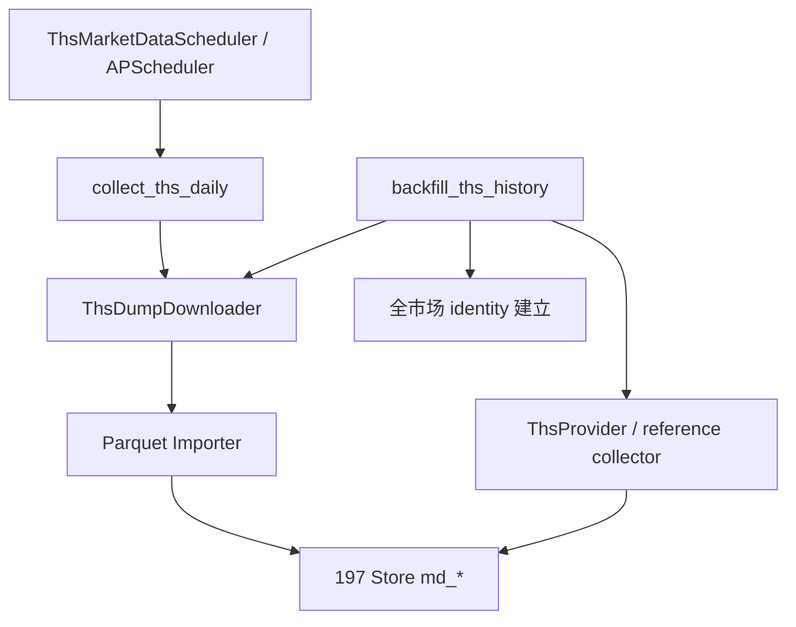

# 迭代 199：设计

## D1. 架构

## D2. 组件

| 组件 | 职责 | 不拥有 |
| --- | --- | --- |
| `ThsDumpDownloader` | 取预签名链接、即时下载 Parquet、大小上限 | 解析业务语义、落库 |
| `ThsDumpImporter` | Parquet → 按标的分组 → 构造 context → collector 落库 | 下载、调度 |
| `ThsMarketIdentitySeeder` | `tickers/list` → InstrumentIdentity 批量落库 | 采集行情 |
| `ThsBackfillRunner` | 编排全量回填（日线/复权/财务/日历），断点续跑 | 业务变换 |
| `ThsDailyCollector` | 每日增量（daily-k-10d + 日历） | 全量回填 |
| `ThsMarketDataScheduler` | 注册每日收盘后任务 | 任务实现 |

## D3. Parquet → store 映射

- 日 K Parquet 一行 = 一个 (thscode, date) observation。
- `date_ms` 归一化：`date_ms` 的 Asia/Shanghai 日期 - 1 天 → UTC midnight（与 198 日线一致）。
- 按 `thscode` 分组 → 每组一个标的的 observations（~2400 条/10 年），单次 ≤ 50_000 上限。
- 落库用 198 的 schedule-only collector 模式（`ThsReferenceCollector` 扩展 `persist_daily_bars`），
  或复用 `ThsProvider` 的归一化逻辑但绕过 HTTP。
- context：unbound（`family_id=None`，`data_kind="bars"`，`dataset_code="market.bars"`）。

## D4. 增量策略

- `daily-k-10d` 覆盖近 10 个交易日；每日运行，幂等（同 event_at 已存在则跳过/新增 revision）。
- 日历每日重拉（近一年）→ CalendarImporter 幂等（同 calendar_version 复用）。
- 财务季度低频；复权因子按标的窗口增量。

## D5. 断点续跑

- 以「标的 + 数据集 + 窗口」为完成单元；读取本地已覆盖范围，仅补缺口。
- 失败标的不阻断整批，累计 `failed_symbols` 与原因码。

## D6. 调度接入

复用现有 APScheduler 基础设施（`AkshareSchedulerService` 模式）：
- 新增 `ThsMarketDataScheduler`，注册每日收盘后（默认 18:00 Asia/Shanghai）任务。
- 通过环境变量 `MARKET_DATA_THS_SCHEDULER_ENABLED`（默认关闭）显式启用。
- 复用 `ThsRateLimiter` 与审计输出，不新建调度平台。

## D7. 安全与回滚

- 回填脚本默认 dry-run；`--apply` 才写库。
- API Key 仅从 `THS_API_KEY` 读取。
- 关闭 `MARKET_DATA_THS_SCHEDULER_ENABLED` 即停止定时任务；已落库数据保留可读。
